# Clara C6 · 嵌入式项目分析报告

> 生成日期：2026-08-25 ｜ 深度：normal/full ｜ 分析范围：Clara C6 全量核心路径（FULL-ANALYSIS）｜ 证据策略：无证据不结论（CONFIRMED / INFERRED / UNKNOWN / CONFLICT / UNVERIFIED）

## 📑 目录

- [一、项目总览](#一项目总览)
  - [1.1 项目一句话画像](#11-项目一句话画像)
  - [1.2 技术栈与关键依赖](#12-技术栈与关键依赖)
  - [1.3 AI 交接摘要](#13-ai-交接摘要)
- [二、总体架构](#二总体架构)
  - [2.1 分层架构](#21-分层架构)
  - [2.2 模块全景](#22-模块全景)
  - [2.3 启动与主运行时](#23-启动与主运行时)
  - [2.4 平台边界](#24-平台边界)
- [三、模块详解](#三模块详解)
  - [3.1 应用编排模块](#31-应用编排模块)
  - [3.2 Clara UI 模块](#32-clara-ui-模块)
  - [3.3 网络传输模块](#33-网络传输模块)
  - [3.4 音频适配模块](#34-音频适配模块)
  - [3.5 板级适配与外设模块](#35-板级适配与外设模块)
- [四、全量路径深挖](#四全量路径深挖)
- [五、状态归属与并发模型](#五状态归属与并发模型)
- [六、构建·烧录·调试·运行](#六构建烧录调试运行)
- [七、变更入口与验证](#七变更入口与验证)
- [八、风险·未知项·冲突](#八风险未知项冲突)
- [九、证据与验证矩阵](#九证据与验证矩阵)
- [十、推荐阅读顺序 & AI 复用提示](#十推荐阅读顺序--ai-复用提示)
- [附录](#附录)

## 一、项目总览

### 1.1 项目一句话画像

这是一个 **CONFIRMED** 的 ESP-IDF 5.x 风格 ESP32-C6 固件应用，目标是让 Waveshare ESP32-C6 Touch AMOLED 2.16 板提供 Clara 会议记录、实时转写、Host 问答和摘要刷新；当前已具备板级启动、LVGL UI、Wi-Fi/HTTPS/WSS 代码和音频采集骨架，但端到端业务链路仍未完成板上验证。

### 1.2 技术栈与关键依赖

| 维度 | 内容 | 证据 | 状态 |
|---|---|---|---|
| MCU/目标 | ESP32-C6，16 MB Flash 配置 | `03_Clara_C6/sdkconfig.defaults:3,5`；`README_ZH.md:3-5` | CONFIRMED |
| 构建系统 | ESP-IDF CMake，工程名 `Clara_C6` | `03_Clara_C6/CMakeLists.txt:1-20` | CONFIRMED |
| RTOS | FreeRTOS 任务、队列、事件组、互斥量 | `main/main.cpp:5-8,139-158`；`clara_net.cpp:24-27` | CONFIRMED |
| UI | LVGL 9.5 + Espressif LVGL adapter | `main/idf_component.yml:9-11`；`components/app_bsp/lvgl_bsp.cpp:59-91` | CONFIRMED |
| 显示/触摸 | SH8601 QSPI 480×480、CST9217 I2C 触摸 | `port_bsp/display_bsp.cpp:27-110`；`main/user_config.h:17-31` | CONFIRMED |
| 音频 | ES8311 输出 + ES7210 输入，16 kHz、双声道 codec 句柄 | `board_cfg.txt:17-21`；`main/main.cpp:176-179` | CONFIRMED |
| PMIC | AXP2101，I2C 地址 0x34，ALDO3 控制显示电源 | `main/main.cpp:172`；`power_bsp.cpp:47-65,119-125` | CONFIRMED |
| 网络 | Wi-Fi STA、HTTP session API、转写 WSS、Host WSS | `clara_net.h:64-97`；`clara_net.cpp:757-1073` | CONFIRMED（代码） |
| 私密配置 | `sdkconfig.local` → `sdkconfig.private`，权限 600 | `03_Clara_C6/CMakeLists.txt:9-24`；`tools/import_private_config.sh:32-40` | CONFIRMED（机制） |
| 当前产物 | 工作区内未发现 Clara build/ELF/bin；历史日志记录过 `build/Clara_C6.bin` | 当前目录扫描；`开发经验.md:96-101,109-114` | CONFLICT/UNVERIFIED |

### 1.3 AI 交接摘要

```text
Project Root: /Volumes/ML/vibe-coding/ESP32-C6-AMOLED-2.16/03_Clara_C6
Project Identity: ESP32-C6 会议记录/Clara UI 固件
Build/Run Entry: cd 03_Clara_C6 && idf.py build; idf.py flash; idf.py monitor（当前 shell 未安装/未配置 idf.py）
Deep-Dive Scope: FULL-ANALYSIS
Core Architecture: app_main 编排 → Clara UI / clara_action 任务 → clara_net HTTP/WSS；audio_task 从 CodecPort 读双声道并下混后发送单声道 PCM；BSP 负责 AXP2101、SH8601/CST9217、ES8311/ES7210。
Critical Files: main/main.cpp；main/clara_ui.cpp；main/clara_net.cpp；main/clara_audio.cpp；components/port_bsp/*；components/pmicpower/power_bsp.cpp；components/ExternLib/codec_board/*。
Main Runtime Flow: app_main → NVS/PMIC/I2C → display/touch/LVGL → codec → action queue/UI → net init/Wi-Fi → 常驻 audio_task。
Key State/Data: s_meeting_active、s_host_active、s_session_id、s_action_queue；网络模块 s_wifi_connected、s_transcribe/s_host WsContext；UI 保存 LVGL 对象指针。
Concurrency/Event Model: LVGL adapter task + Wi-Fi/WebSocket callbacks + clara_action task + clara_audio task；UI setter 通过 Lvgl_lock；网络回调直接调用 UI setter。
Hardware/Platform Boundaries: user_config.h pins → I2C/SPI/I2S driver → esp_lcd/esp_codec_dev → LVGL adapter。
Main Risks: LVGL 64 KB 内存池对多卡片页面仍可能不足；clara_audio.cpp 未接入 main；Host answer audio 事件未播放；VAD 配置未使用；无当前可复现 build 产物；无 OTA 分区。
Unknowns: 当前 sdkconfig.local 内容、板上热点/API 服务可达性、完整 WSS 协议实测、MP3 decoder 是否被依赖传递进来、当前板上固件版本。
Next Best Actions: 先恢复 ESP-IDF 环境并全量 build；把实际音频路径统一到 clara_audio；接入 HOST_ANSWER_AUDIO 播放；提高/测量 LVGL heap；用可见热点执行 Start/Stop/Ask/Refresh 全链路。
```

## 二、总体架构

### 2.1 分层架构

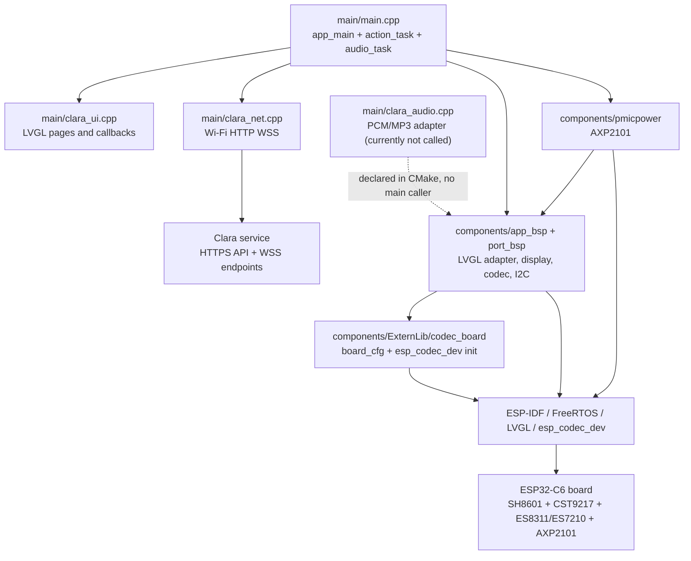

- `CONFIRMED`: `main/CMakeLists.txt` 把 app_bsp、port_bsp、pmicpower、ui_bsp 和网络依赖链接在一起。
- `CONFIRMED`: `clara_audio.cpp` 是编译单元，但调用关系图中用虚线表示它尚未进入 `main.cpp` 的实际运行路径。
- 工程后果：修改显示/触摸要从 `display_bsp` 和 `lvgl_bsp` 进入；修改会议业务要从 `main.cpp`/`clara_net.cpp` 进入；修改音频协议前必须先决定是否统一使用 `clara_audio`。

### 2.2 模块全景

| 模块 | 责任 | 关键入口 | 依赖/边界 | 证据 |
|---|---|---|---|---|
| 应用编排 | 初始化、状态机、动作队列、音频任务 | `app_main`, `action_task`, `audio_task` | FreeRTOS、UI、Net、CodecPort | `main.cpp:57-200` |
| Clara UI | Home/Clara/Demo 页面、触摸事件、状态展示 | `clara_ui_init`, `clara_ui_set_*` | LVGL adapter | `clara_ui.cpp:131-440` |
| 网络 | Wi-Fi、session HTTP、转写/Host WSS、事件解析 | `clara_net_init`, `clara_net_*` | esp_wifi/http/websocket/cJSON/TLS | `clara_net.cpp:698-1073` |
| 音频适配 | 双声道 codec 与单声道 PCM、可选 MP3 | `clara_audio_init*`, `clara_audio_read/write` | esp_codec_dev、FreeRTOS mutex | `clara_audio.cpp:325-666` |
| 板级适配 | I2C/SPI/QSPI/I2S、PMIC、codec board | `I2cMasterBus`, `DisplayPort`, `CodecPort`, `Custom_PmicPortInit` | SH8601/CST9217/ES8311/ES7210/AXP2101 | `components/*` |
| 生成 UI | SquareLine 生成页和字体 | `setup_ui`, `events_init` | LVGL | `ui_bsp/generated/*` |

### 2.3 启动与主运行时

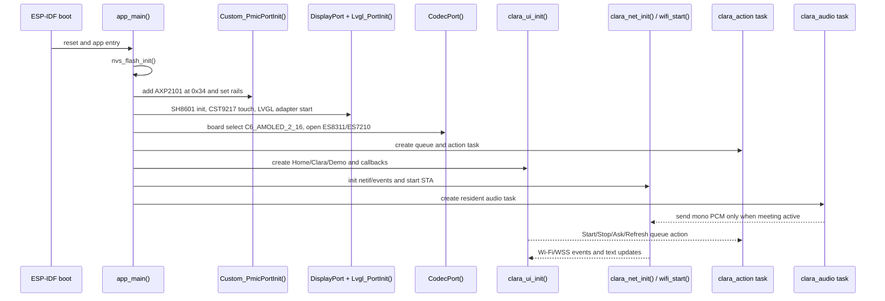

- `CONFIRMED`: `app_main` 初始化顺序见 `main.cpp:165-200`。
- `CONFIRMED`: `audio_task` 常驻创建，但空闲时只轮询等待；会议启动后才读 codec 和发送网络音频。
- `UNVERIFIED`: 当前工作区没有 build/串口日志可重放；启动成功证据来自历史 `开发经验.md:123-128`。

### 2.4 平台边界

应用跨越点是：`clara_ui.cpp` → `Lvgl_lock` → `esp_lv_adapter`；`CodecPort` → `esp_codec_dev` → I2S；`DisplayPort` → `esp_lcd_new_panel_sh8601`/`esp_lcd_touch_new_i2c_cst9217`；`clara_net.cpp` → ESP-IDF Wi-Fi/HTTP/WebSocket/TLS；`power_bsp.cpp` → XPowers AXP2101 I2C。所有引脚来自 `main/user_config.h` 与 `board_cfg.txt`，不存在运行时设备探测。

## 三、模块详解

### 3.1 应用编排模块

#### 模块架构图

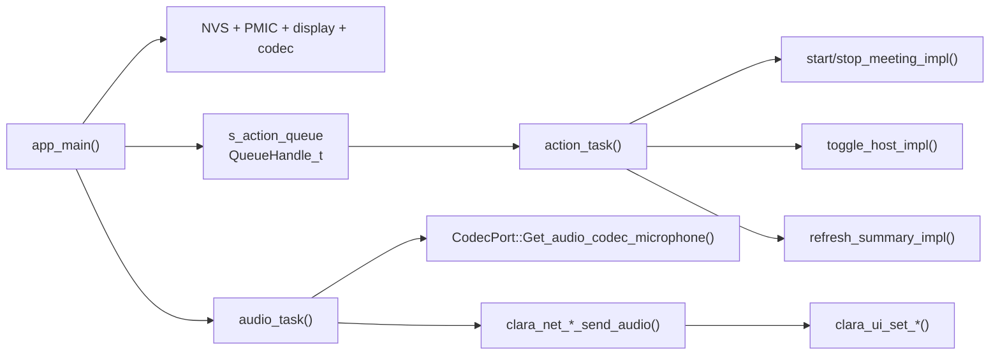

- 点击事件不直接执行同步网络 I/O，而是进入队列；这是针对历史 LVGL 任务阻塞问题的修复记录（`开发经验.md:144-149`）。
- `s_meeting_active`、`s_host_active` 是应用层事实状态；UI 有镜像状态，必须由主模块更新。

#### 实现与调用关系图

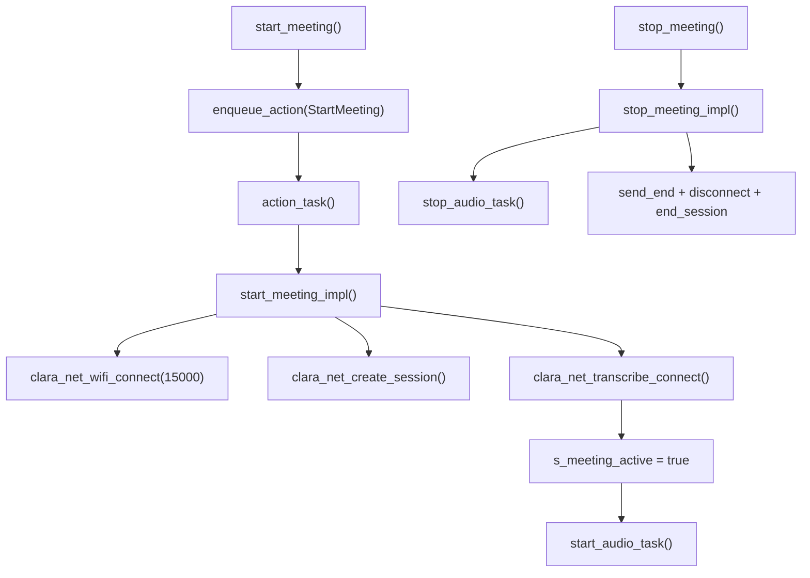

| 文件/入口 | 状态与接口 | 证据 |
|---|---|---|
| `main.cpp:88-115` | 会议生命周期；创建/关闭 session 与转写 WSS | CONFIRMED |
| `main.cpp:117-134` | Host 开关与摘要 GET | CONFIRMED |
| `main.cpp:139-163` | 队列消费者与 UI 回调入队 | CONFIRMED |
| `main.cpp:57-73` | 20 ms 音频读块、下混、网络发送 | CONFIRMED |

风险与验证：当前 `audio_task` 没有调用 `clara_audio_read_mono_pcm16`，而是直接 `esp_codec_dev_read`；应在统一音频路径后用串口和服务端帧计数验证。停止时网络发送可能阻塞，需测量 Stop 延迟。

### 3.2 Clara UI 模块

#### 模块架构图

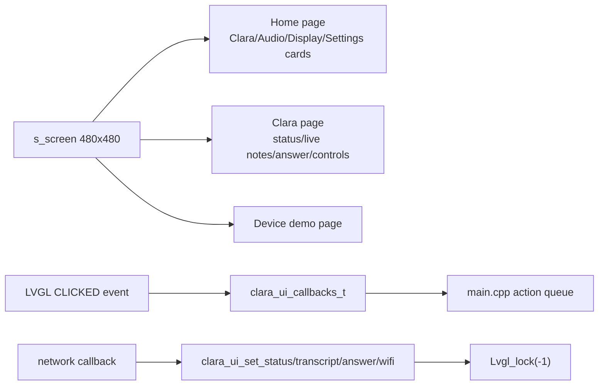

- `CONFIRMED`: Clara 页面是手写 LVGL 9 UI，入口 `clara_ui_init` 创建三页；生成的 SquareLine 页面并不在该调用路径。
- `CONFIRMED`: 所有外部 setter 获取 `Lvgl_lock`，避免网络线程直接改 LVGL 对象时并发破坏。
- 风险：默认 `CONFIG_LV_MEM_SIZE_KILOBYTES=64`，历史实机在头像对象分配处耗尽并 panic（`开发经验.md:103-107`）。

#### 实现与调用关系图

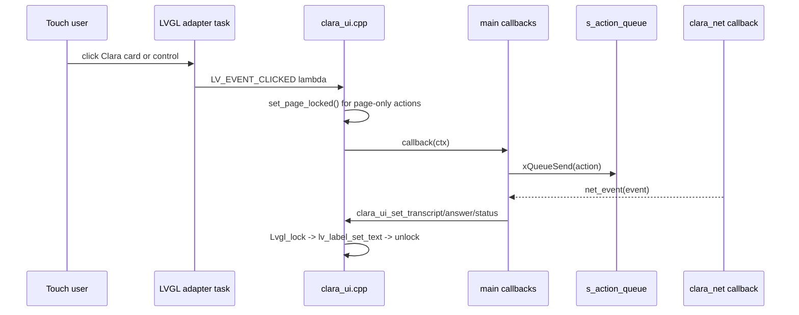

关键文件：`clara_ui.cpp:67-109`（按钮事件）、`131-334`（页面构造）、`343-352`（锁内页面切换）、`356-440`（公共 API）。生成 UI `ui_bsp/generated/events_init.c:20-23` 为空，`custom.c:38-41` 为空，属于未接入的并行 UI 资产。

### 3.3 网络传输模块

#### 模块架构图

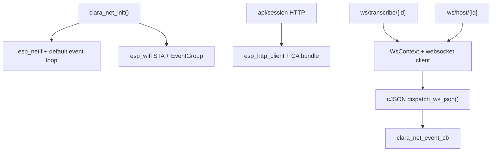

- `CONFIRMED`: HTTP 成功依赖 2xx；响应上限 16 KB，WSS 接收上限 16 KB（`clara_net.cpp:51-55,255-310,515-545`）。
- `CONFIRMED`: 转写发送 binary PCM，Host 发送 Base64 JSON（`clara_net.h:84-97`）。

#### 实现与调用关系图

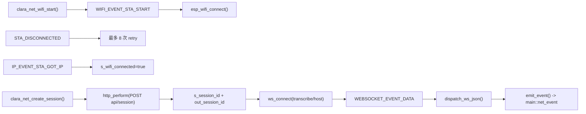

关键状态：`s_wifi_started/connected/retries`、`s_session_id`、两个 `WsContext`；`s_lock` 保护句柄与事件回调指针。事件 payload 只在 callback 期间有效（`clara_net.h:3-7`），但当前 `main::net_event` 立即消费文本，没有异步保存。

### 3.4 音频适配模块

#### 模块架构图

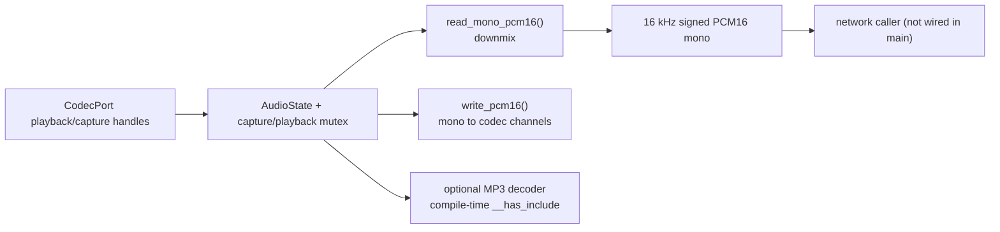

- `CONFIRMED`: 适配器支持 16/24/32-bit 样本读写、下混、展开和锁保护（`clara_audio.cpp:85-120,198-232,325-399`）。
- `CONFIRMED`: MP3 API 在缺少 `esp_audio_codec` 头文件时返回 `ESP_ERR_NOT_SUPPORTED`（`clara_audio.cpp:15-27,566-666`）。
- `INFERRED`: 当前工程默认不会启用 MP3，因为 `main/idf_component.yml` 未声明 `esp_audio_codec`。

#### 实现与调用关系图

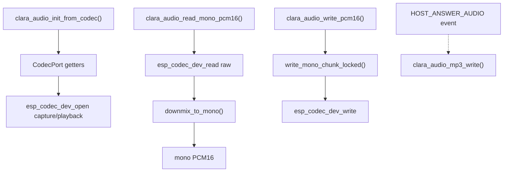

当前运行事实是 `main.cpp:61-68` 直接调用 `esp_codec_dev_read`，并未调用本模块；同时 `main.cpp:37-54` 没有 `CLARA_NET_EVENT_HOST_ANSWER_AUDIO` 分支，因此回答音频既未解码也未播放。

### 3.5 板级适配与外设模块

#### 模块架构图

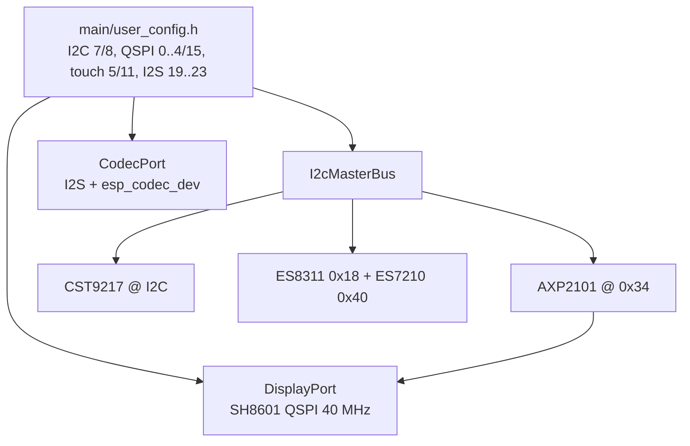

- `CONFIRMED`: 显示通过 ALDO3 断电/上电复位（`display_bsp.cpp:80-87`），LCD reset GPIO 为 NC。
- `CONFIRMED`: `board_cfg.txt` 的 C6 条目与 `user_config.h` I2C/I2S 引脚一致。

#### 实现与调用关系图

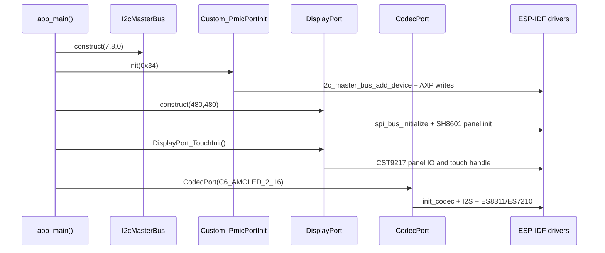

关键文件：`i2c_bsp.cpp:8-19`、`display_bsp.cpp:27-110`、`codec_bsp.cpp:44-69`、`power_bsp.cpp:47-95`。`Axp2101_isChargingTask` 已实现但 `app_main` 未创建，电量/充电状态没有进入 Clara UI。

## 四、全量路径深挖

### 路径 1：上电到可用 UI（FULL-ANALYSIS）

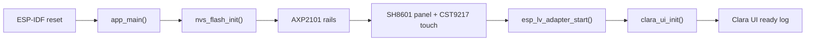

历史串口已确认 PMIC、SH8601、CST9217、codec 和 LVGL 初始化完成，并打印 `Clara UI ready; touch the Clara tile`（`开发经验.md:123-128`）。但当前报告环境没有对应 build/log 文件，属于历史实机证据。

### 路径 2：Start Meeting（FULL-ANALYSIS）

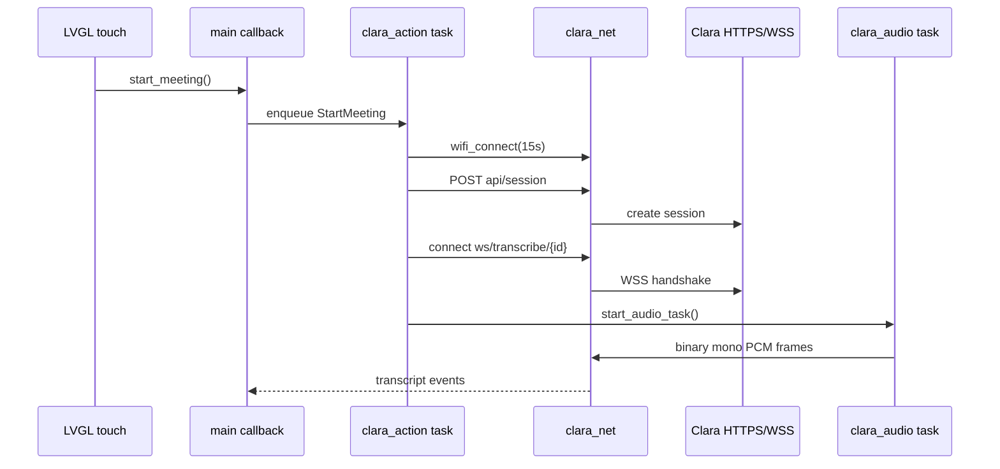

失败点：私密配置为空、热点不可见、API URL scheme/path 错误、HTTP 非 2xx、WSS 超时、音频发送阻塞。历史板上仅到 `reason=201 / NO_AP_FOUND`，尚未从 C6 发起 session/WSS（`开发经验.md:151-157`）。

### 路径 3：Host Q&A 与回答播放（FULL-ANALYSIS，未完成）

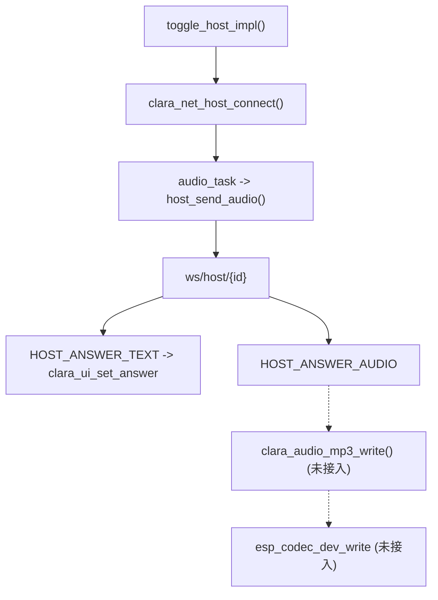

`HOST_ANSWER_TEXT` 已显示；`HOST_ANSWER_AUDIO` 只在网络模块产生事件，主回调未处理，因而“Clara 会说话”仍是 `UNKNOWN/未完成`。`host_send_end_of_speech` 也没有被 `main.cpp` 调用。

### 路径 4：Refresh Summary（FULL-ANALYSIS）

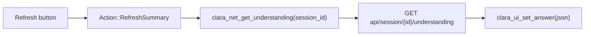

该路径只有在 `s_session_id` 非空且服务返回小于 16 KB 时成功；UI 直接展示原始 JSON，没有结构化摘要模型或分页。

## 五、状态归属与并发模型

### 5.1 核心状态归属表

| 状态/数据 | 初始化者 | 写入者 | 读取者 | 跨上下文 | 保护/隐患 | 证据 |
|---|---|---|---|---|---|---|
| `s_meeting_active` | `main.cpp` | action task | audio task/UI flow | 是 | `volatile`，无 mutex；状态转换集中在 action task | `main.cpp:25,88-115` |
| `s_host_active` | `main.cpp` | action/net callback | audio task/UI | 是 | `volatile`，Host 连接事件与 action 可能交错 | `main.cpp:26,48-50,117-126` |
| `s_session_id[96]` | `main.cpp`/net | create/stop | HTTP/WSS/action | 是 | net 有自身 `s_lock`，main 副本无锁 | `main.cpp:24,96-113`; `clara_net.cpp:90,907-909` |
| `s_action_queue` | `app_main` | LVGL callbacks | `action_task` | 是 | 队列长度 4，满时只显示忙碌 | `main.cpp:181-185,153-163` |
| `WsContext` | `clara_net_init/ws_connect` | WebSocket worker/net APIs | send/cleanup | 是 | `s_lock` + `connected` volatile；销毁在回调外 | `clara_net.cpp:62-70,587-609` |
| LVGL object pointers | `clara_ui_init` | LVGL task/setters | UI setters | 是 | setter 使用 `Lvgl_lock`；构造阶段缺少 null guard | `clara_ui.cpp:22-40,356-440` |
| 音频缓冲 | `main.cpp` 静态全局 | audio task | network send | 是 | 不占任务栈；发送 API 可能阻塞 | `main.cpp:31-33,57-70` |
| `clara_audio::AudioState` | 未调用 | 适配器 API | 适配器 API | 潜在 | 双 mutex；当前不在业务路径 | `clara_audio.cpp:35-61` |

### 5.2 并发与事件模型

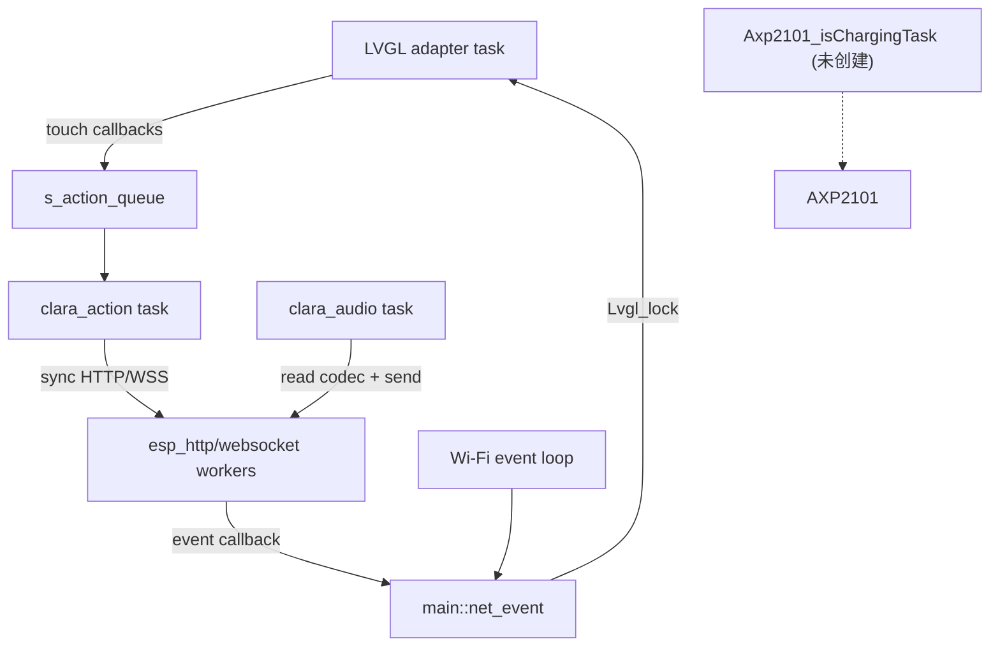

主要并发风险是 UI 锁与网络回调的长时间耦合、`volatile` 状态缺少统一状态机、音频发送和停止操作的阻塞时间，以及网络回调中传递 callback-scoped 指针的生命周期约束。

## 六、构建·烧录·调试·运行

| 事项 | 当前入口/命令 | 当前证据 | 状态 |
|---|---|---|---|
| 配置 | `cd 03_Clara_C6 && idf.py reconfigure` | `CMakeLists.txt:9-18` | UNVERIFIED（当前 shell 无 idf.py） |
| 构建 | `idf.py build` | `CMakeLists.txt`、历史 `开发经验.md:96-101` | 历史 CONFIRMED，当前不可重放 |
| 烧录 | `idf.py -p <port> flash` | 未发现 Clara 专用脚本；历史端口 `/dev/cu.usbmodem1101` | UNVERIFIED |
| 监视 | `idf.py monitor` 或 pyserial 只读采集 | `开发经验.md:166-170` | UNVERIFIED |
| 产物 | `build/Clara_C6.bin`、ELF | 当前工作区未发现 build；历史日志声称曾生成 | CONFLICT |
| 分区 | `nvs 0x6000`、`phy_init 0x1000`、`factory 6M`、`storage 3M` | `partitions.csv:1-6` | CONFIRMED |
| OTA | 无 OTA app 分区和 OTA 代码 | `partitions.csv`、Clara 源码搜索 | UNKNOWN/未实现 |

当前构建的首要前置条件是恢复 ESP-IDF v5.5.3 环境、让组件管理器获取 `esp_websocket_client`、`esp_codec_dev`、`esp_lcd_sh8601`、LVGL 9、CST9217 和 adapter，然后确认 `sdkconfig.local` 未泄漏。

## 七、变更入口与验证

| 任务 | 起始文件/符号 | 修改边界 | 最小验证 |
|---|---|---|---|
| 改首页/Clara 页面 | `main/clara_ui.cpp:create_*` | 手写 UI；不要改 generated 目录 | 编译 + 上板无 LVGL panic + 触摸回调 |
| 改会议生命周期 | `main/main.cpp:start/stop_meeting_impl` | 保持 action queue，不在 LVGL callback 做同步 I/O | Wi-Fi 失败、Start/Stop、重复点击 |
| 改 HTTP/WSS 协议 | `main/clara_net.cpp` | 保持 URL 校验、TLS bundle、响应上限、callback 生命周期 | mock/服务端联调 + C6 WSS 抓包/日志 |
| 改音频格式 | 先统一 `main.cpp` 与 `clara_audio.cpp` | 16 kHz/16-bit/mono 网络契约 | codec 回环、帧长度、服务端识别 |
| 接入回答音频 | `main.cpp:net_event` + `clara_audio_mp3_*` | 处理 `HOST_ANSWER_AUDIO`、串行化播放器 | 分片 MP3、EOS、扬声器播放 |
| 调 LVGL 内存 | `sdkconfig.defaults` + UI 构造空指针检查 | 评估无 PSRAM 的内部 RAM | heap watermark、连续启动 |
| 改引脚/外设 | `main/user_config.h`、`board_cfg.txt`、`display_bsp.cpp` | 与原理图同步 | I2C 扫描、显示/触摸/codec 日志 |
| 改私密配置 | `tools/import_private_config.sh`、`sdkconfig.local` | 不提交、不打印值 | 检查 `sdkconfig.private` 权限 600 和生成宏 |

## 八、风险·未知项·冲突

1. **高：LVGL 内存池仍为 64 KB。** 历史实机在 `create_home()` 头像对象分配时耗尽并触发 Load access fault；当前默认值仍是 `CONFIG_LV_MEM_SIZE_KILOBYTES=64`，且页面构造大多未检查空指针（`sdkconfig.defaults:19`、`clara_ui.cpp:170-190`）。
2. **高：音频适配器与业务路径分叉。** `clara_audio.cpp` 有 666 行实现但 `main.cpp` 直接调用 `esp_codec_dev_read/write`；维护者容易修一边、运行另一边。
3. **高：Host 回答音频未闭环。** `CLARA_NET_EVENT_HOST_ANSWER_AUDIO` 被产生但未消费；MP3 依赖也未在 manifest 中明确声明。
4. **高：板上业务链路未验证。** 历史日志显示 Wi-Fi `reason=201 / NO_AP_FOUND`，尚未完成从 C6 发起 session、转写 WSS、Host WSS 或 understanding 请求（`开发经验.md:151-157`）。
5. **中：当前工作区无 build 产物、无 `idf.py`。** 历史“构建通过”不能替代本机可复现构建；需重新配置后确认依赖解析和链接。
6. **中：生成 UI 与手写 UI 并存。** `ui_bsp/generated` 被编译但 `main` 不调用 `setup_ui`，事件初始化为空；会增加字体/对象体积和维护歧义。
7. **中：私密导入脚本默认源路径是旧机器 `/Users/hsh/...`。** 当前目录用户为 `/Users/hushaohong`；不传参数时脚本可能找不到配置（`tools/import_private_config.sh:4-10`）。
8. **低：分区只有 factory + storage，没有 OTA。** 生产升级、回滚和失败恢复尚未设计。
9. **中：依赖声明与源码最低版本不一致。** `main/idf_component.yml:7-8` 声明 IDF `>=4.1.0`，但工程使用 `driver/i2c_master.h`、新 I2S API、LVGL adapter 和历史验证环境 IDF v5.5.3；低版本兼容性没有证据。

**UNKNOWN/需要补证据：** 当前 `sdkconfig.local` 实际是否存在及其非空状态；当前板上烧录的是哪个版本；Clara 服务端协议的完整 JSON/MP3 约定；MP3 组件是否被其他依赖传递；C6 实际可用 heap watermark；触摸/显示/codec 在当前提交上的最新串口日志。

## 九、证据与验证矩阵

| 结论 | 证据 | 置信度 | 仍需验证 |
|---|---|---|---|
| 目标是 ESP32-C6 | `sdkconfig.defaults:3`、`README_ZH.md:3-5` | CONFIRMED | 无 |
| 480×480 SH8601/CST9217 已初始化 | `display_bsp.cpp:27-110`、历史日志 | CONFIRMED（源码+历史实机） | 当前提交重刷一次 |
| PMIC AXP2101 初始化 | `power_bsp.cpp:47-95`、历史日志 | CONFIRMED | 电源轨实测 |
| UI 曾启动到 ready log | `开发经验.md:123-128` | CONFIRMED（历史日志） | 当前工作区无日志副本 |
| Wi-Fi 自动重试 | `clara_net.cpp:313-349` | CONFIRMED（代码） | 热点可见时实测 |
| HTTPS/WSS 协议实现 | `clara_net.cpp:840-1073` | CONFIRMED（代码） | 板上服务联调 |
| Clara session/WSS 已在板上成功 | 无；历史明确未做到 | UNKNOWN/未完成 | 热点 + API + 端到端测试 |
| 音频 MP3 回答播放 | 无 `main` 消费路径 | UNKNOWN/未完成 | 接线后硬件播放 |
| 当前提交可复现整机构建 | 工作区无 build，shell 无 idf.py | UNVERIFIED | 恢复 IDF 并执行 build |

## 十、推荐阅读顺序 & AI 复用提示

推荐顺序：

1. `开发经验.md:76-177`：先了解已经发生的实机问题、修复和验证边界。
2. `03_Clara_C6/main/main.cpp`：掌握真实运行入口、任务、状态和调用分叉。
3. `03_Clara_C6/main/clara_ui.cpp`：理解手写 UI 与 LVGL 锁。
4. `03_Clara_C6/main/clara_net.cpp/.h`：理解 Wi-Fi/HTTP/WSS 协议与回调生命周期。
5. `03_Clara_C6/components/port_bsp/*`、`pmicpower/power_bsp.cpp`：核对硬件边界和引脚。
6. `03_Clara_C6/main/clara_audio.cpp`：决定是否替换当前 main 中的直读路径。
7. `03_Clara_C6/components/ui_bsp/generated/*`：仅在决定保留 SquareLine UI 时继续维护。

给后续 AI 的硬约束：不要把 `clara_audio.cpp` 的实现当成已运行功能；不要把历史 `idf.py build` 记录当成当前工作区可复现构建；不要把服务端 HTTP 200 健康检查当成 C6 已联网；不要提交 `sdkconfig.local`、`sdkconfig.private` 或任何会议内容。

## 附录

### 已确认事实

- C6 目标、16 MB Flash、480×480 显示、CST9217 触摸、AXP2101、ES8311/ES7210 和主要引脚均有源码/配置证据。
- Clara 手写 UI、网络模块、action queue 和常驻音频任务均存在于当前提交。
- 历史实机已到达 UI ready，但网络受 `NO_AP_FOUND` 阻塞，尚无业务全链路实测。

### 推断事实

- MP3 分支通常不会编译启用，因为主组件 manifest 未显式声明 `esp_audio_codec`；需要通过实际依赖图确认。
- 生成 UI 资产目前只是编译负担，因为 `main` 没有调用 `setup_ui`。

### 报告保存路径

- Markdown：`docs/embedded-project-intake-clara-c6.md`
- HTML：`docs/embedded-project-intake-clara-c6.html`
